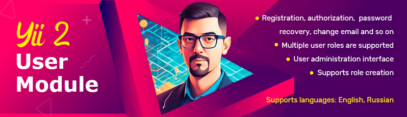

# Yii2 user



[](https://packagist.org/packages/zakharov-andrew/yii2-user)
[](https://packagist.org/packages/zakharov-andrew/yii2-user)
[](https://packagist.org/packages/zakharov-andrew/yii2-user)
[](http://www.yiiframework.com/)

Yii2 user authentication module for management users and their rights.

- Registration, authorization, password recovery, change email and so on
- User administration interface
- Supports role creation
- Multiple user roles are supported
- Happy Birthday widgets
- logging of failed authorization attempts and blocking access via IP
- Supports languages: English, Russian

## 🚀 Installation

The preferred way to install this extension is through [composer](http://getcomposer.org/download/).

Either run

```
$ composer require zakharov-andrew/yii2-user
```
or add

```
"zakharov-andrew/yii2-user": "*"
```

to the ```require``` section of your ```composer.json``` file.

Subsequently, run

```
./yii migrate/up --migrationPath=@vendor/zakharov-andrew/yii2-user/migrations
```

in order to create the settings table in your database.

Or add to console config

```php
return [
    // ...
    'controllerMap' => [
        // ...
        'migrate' => [
            'class' => 'yii\console\controllers\MigrateController',
            'migrationPath' => [
                '@console/migrations', // Default migration folder
                '@vendor/zakharov-andrew/yii2-user/src/migrations'
            ]
        ]
        // ...
    ]
    // ...
];
```

## 🛠 Usage

Add this to your main configuration's modules array

```php
    'modules' => [
        'user' => [
            'class' => 'ZakharovAndrew\user\Module',
            'bootstrapVersion' => 5, // if use bootstrap 5
            'showTitle' => true, // display H1 headings (default - true)
            'enableUserSignup' => false, //Toggles user registration functionality (default - false)
            'telegramToken' => '', // necessary for the bot to work
            'telegramBotLink' => 'https://t.me/YOUR_BOT_NAME_FOR_USER_LINK', //change!
            // use for menu and access
            'controllersAccessList' => [
                1001 => [
                            'Users' => [
                                '/user/user/index' => 'users',
                                '/user/user/create' => 'create user',
                            ],
                        ], 
                1002 => ['/user/roles/index' => 'Roles']
            ],
            'wallpapers' => [
                [
                    'url' => 'path/to/wallpaper1.jpg',
                    'roles' => ['user', 'admin'], // available to which roles
                ],
                [
                    'url' => 'path/to/wallpaper2.jpg',
                    'roles' => ['admin'], // only for admin
                ],
            // ...
            ],
        ],
        // ...
    ],
```

Add this to your ```config\params.php```

```php
return [
    // ...
    'supportEmail' => 'change-this-email@test.com',
    // lifetime of the password reset token
    'userResetPasswordTokenExpire' => 3600
    // ...
];
```

**If a pretty URL is enabled:**

Add this to your main configuration's urlManager array

```php
'urlManager' => [
    //...
    'rules' => [
        'login' => 'user/user/login',
        'logout' => 'user/user/logout',
        'profile' => 'user/user/profile',
        'signup' => 'user/user/signup',
        'wallpapers' => 'user/wallpaper/index',
        //...
    ],
    //...
],
```

## 🎉 Happy Birthday widget

You can use the birthday greeting widget by customizing both the header and the message indicating that there are no birthdays today:

```php
<?= \ZakharovAndrew\user\components\BirthdayWidget::widget([
    'headerMessage' => 'Today’s birthdays:',
    'noBirthdaysMessage' => 'Today, no one is celebrating a birthday.', // or empty
    'useAvatars' => true
]); ?>
```

Widget for congratulating the user on his birthday:

```php
<?= \ZakharovAndrew\user\components\BirthdayGreetingWidget::widget([
    'message' => '<h1>Happy Birthday, {username}!</h1>'
]) ?>
```

## 👥 Contributing

Contributions are welcome! Please feel free to submit a Pull Request.

1. Fork the repository
2. Create your feature branch (`git checkout -b feature/amazing-feature`)
3. Commit your changes (`git commit -m 'Add some amazing feature'`)
4. Push to the branch (`git push origin feature/amazing-feature`)
5. Open a Pull Request

## 📄 License

**yii2-user** it is available under a MIT License. Detailed information can be found in the `LICENSE.md`.
